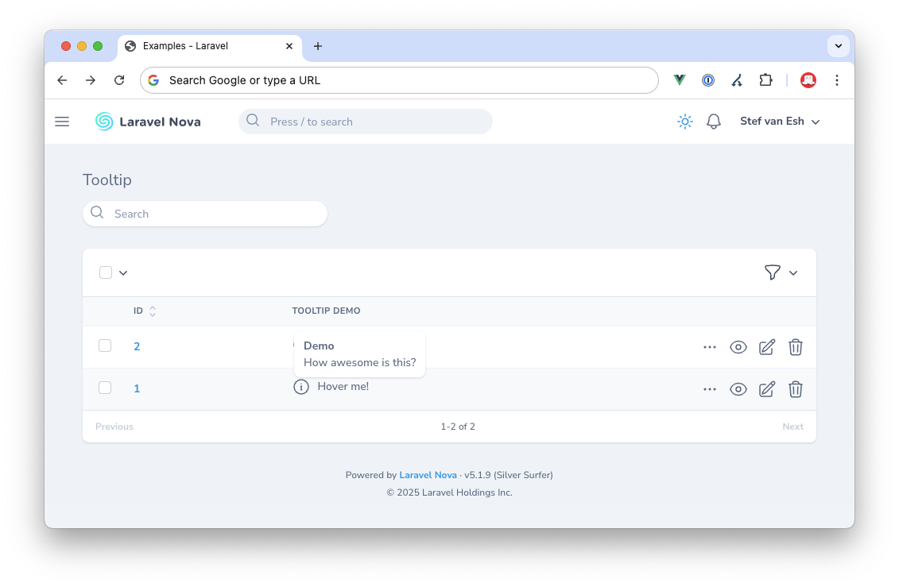

[](https://github.com/marshmallow-packages/nova-tooltip-field)
[](https://github.com/marshmallow-packages/nova-tooltip-field)
[](https://github.com/marshmallow-packages/nova-tooltip-field)

# Laravel Nova Totals footer
This [Laravel Nova](https://nova.laravel.com) field enables you to make use of the default Nova Tooltip component.

## Screenshot


## Requirements

- `php: ^8.1`
- `laravel/nova: ^5.0`

## Installation

Install via composer:

``` php
composer require marshmallow/nova-tooltip-field
```

## Usage
The usage is extreamly simple. You just call the field as you whould any other Nova Field. The example below is the same as we have used to create the screenshot on top of this page.

```php
NovaTooltipField::make('Tooltip Demo')
    ->resolveUsing(function ($value) {
        return '<strong>Demo</strong><br/>How awesome is this?';
    })
    ->tooltip('Hover me!')
    ->tooltipIcon('information-circle')
    ->tooltipIconType('outline');
```

### Options

All the options that are available on the Nova Tooltip component can be set via the methods listed below.

| Method                | Description                                                                 |
|-----------------------|-----------------------------------------------------------------------------|
| `distance(0)` | Sets the distance between the tooltip and the target element. |
| `skidding(20)` | Adjusts the offset of the tooltip along the target element. |
| `boundary('window')` | Defines the boundary within which the tooltip should be constrained. |
| `placement('left')` | Specifies the position of the tooltip relative to the target element. E.g. `auto`, `auto-start`, `auto-end`, `top`, `top-start`, `top-end`, `right`, `right-start`, `right-end`, `bottom`, `bottom-start`, `bottom-end`, `left`, `left-start` or `left-end` |
| `triggers(['hover'])` | Sets the events that trigger the tooltip. E.g. `click`, `hover`, `focus` or `touch` |
| `autoHide(true)` | Determines whether the tooltip should automatically hide after showing. |
| `tooltip('Hover me!')`| Sets the text content of the tooltip.                                       |
| `tooltipIcon('information-circle')` | Specifies the icon to be displayed in the tooltip. This can be a string or a callble. |
| `tooltipIconType('outline')` | Defines the style of the tooltip icon. E.g. `solid`, `outline`, `mini` or `micro` |
| `preventOverflow(false)` | Prevents the tooltip from overflowing its boundary. |
| `theme('plain')` | Sets the theme of the tooltip. E.g. `nova`, `tooltip`, `dropdown`, `menu` or `plain` |
| `maxWith(400)` | Defines the maximum width of the tooltip. |
| `tooltipTriggerStyling('text-green-500 dark:text-green-400')` | Set the color classes that need to be used for the tooltip trigger text and for the tooltip trigger icon. |
| `tooltipTriggerTextStyling('text-green-500 dark:text-green-400')` | Set the color classes that need to be used for the tooltip trigger text. |
| `tooltipTriggerIconStyling('text-green-500 dark:text-green-400')` | Set the color classes that need to be used for the tooltip trigger icon. |

### Options with a little bit more context
#### tooltipIcon
The `tooltipIcon` method will accept a string, being an icon name, or it will accept a callable where you can "calculate" the icon you want to use. E.g.

```php
->tooltipIcon(function () {
    return $this->field_01 > 0 ? 'arrow-up' : 'arrow-down';
})
```

#### tooltipTriggerTextStyling and tooltipTriggerIconStyling
The `tooltipTriggerTextStyling` and `tooltipTriggerIconStyling` methods will accept a string, being a class name, or it will accept a callable where you can "calculate" the class you want to use. The second parameter of this method tells the tooltip if we need to use this value as a class or as an inline styling. By default this method will use your value as classes, set the `as_inline_style` to true and it will use inline styling.

```php
/** Set the text color for the tooltip trigger text */
->tooltipTriggerTextStyling(function () {
    return 'color:#ff133b;';
}, asInlineStyle: true)

/** Set the text color for the tooltip trigger icon */
->tooltipTriggerIconStyling(function () {
    return 'text-red-500';
}, asInlineStyle: false)
```

## Licence

The MIT License (MIT). Please see [License File](LICENCE) for more information.

## 💖 Sponsorships

If you are reliant on this package in your production applications, consider [sponsoring us](https://github.com/sponsors/marshmallow-packages)! It is the best way to help us keep doing what we love to do: making great open source software.

## Contributing

Feel free to suggest changes, ask for new features or fix bugs yourself. We're sure there are still a lot of improvements that could be made, and we would be very happy to merge useful pull requests.

### Special thanks to
-   [All Contributors](../../contributors)

## Made with ❤️ for open source

At [Marshmallow](https://marshmallow.nl) we use a lot of open source software as part of our daily work.
So when we have an opportunity to give something back, we're super excited!

We hope you will enjoy this small contribution from us and would love to [hear from you](mailto:hello@marshmallow.nl) if you find it useful in your projects. Follow us on [Twitter](https://x.com/marshmallow_dev) for more updates!
